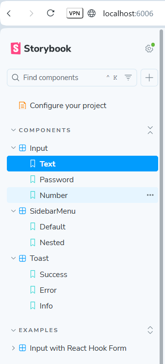
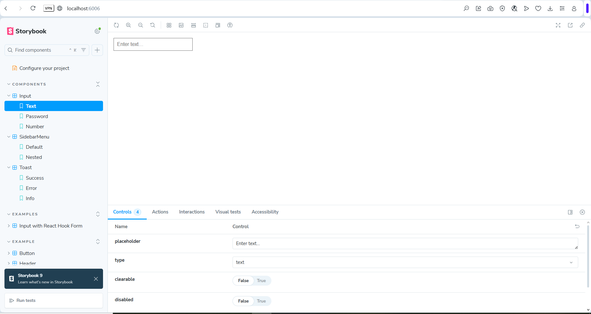
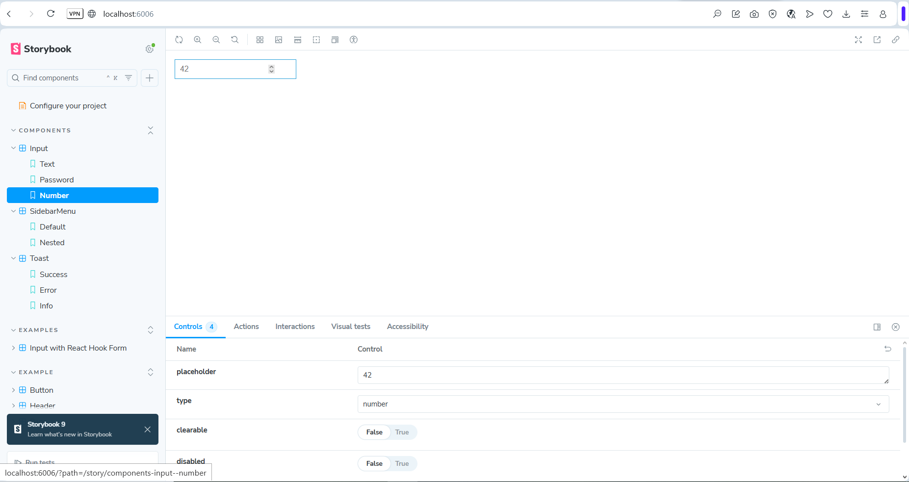
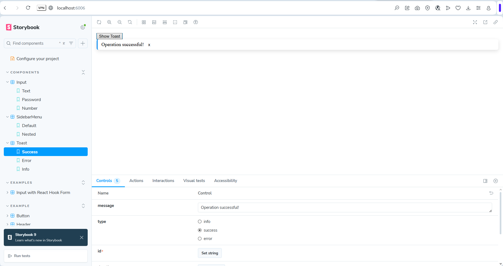
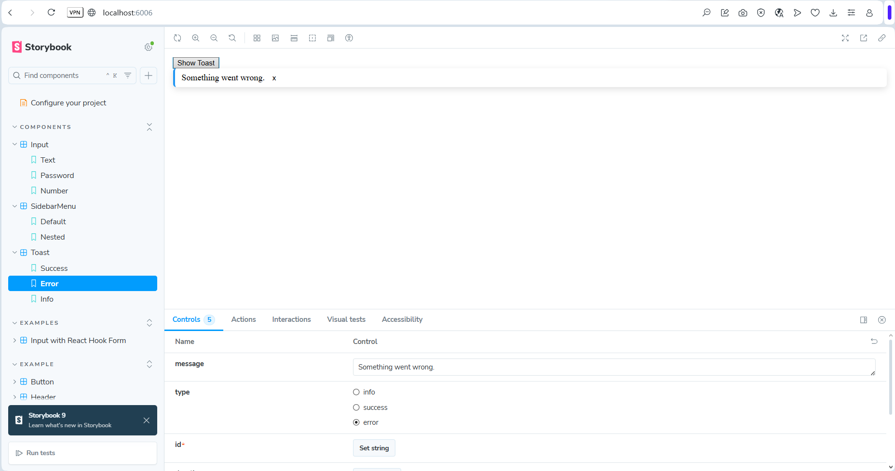
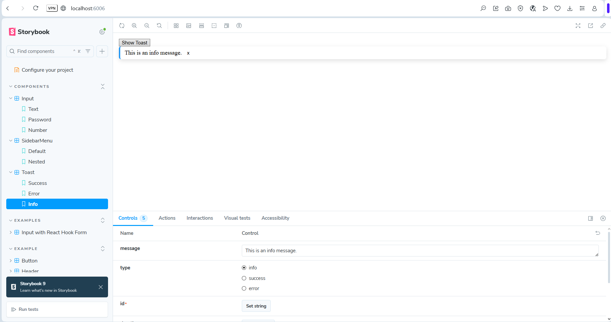
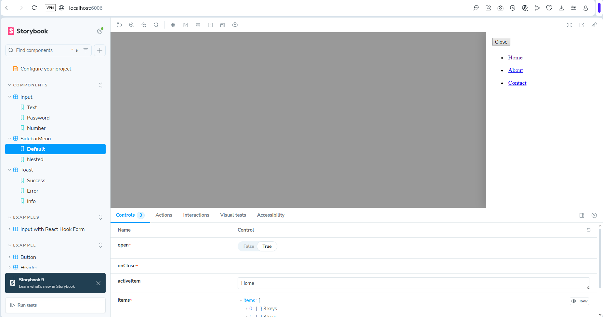
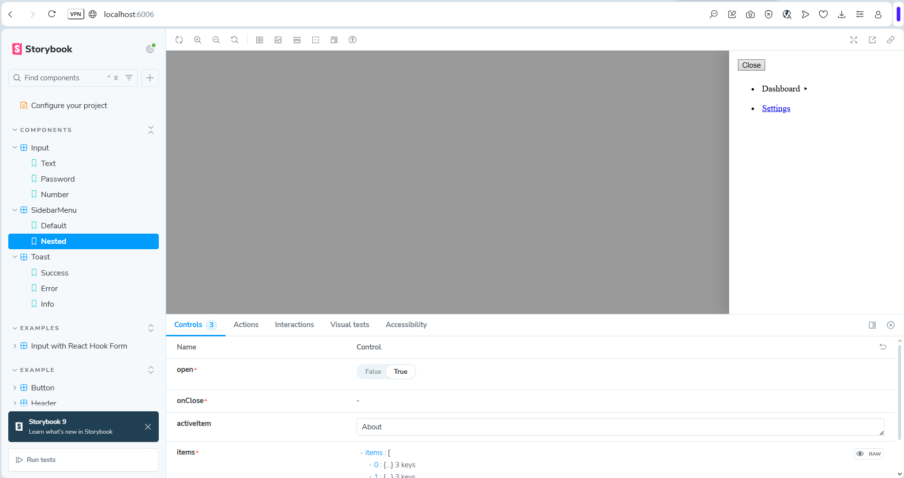
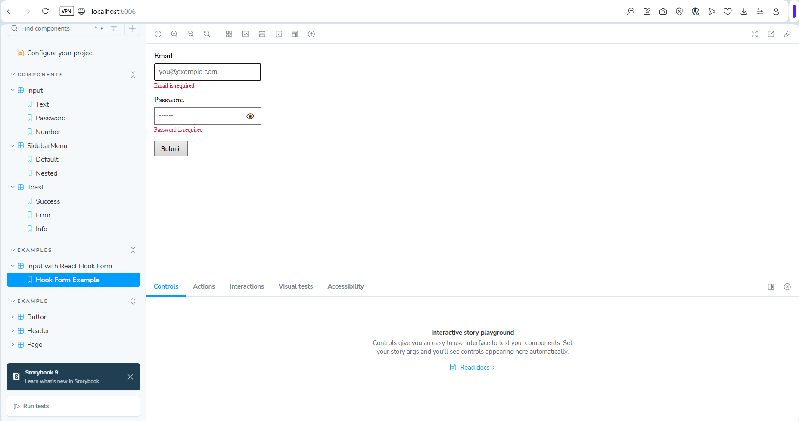
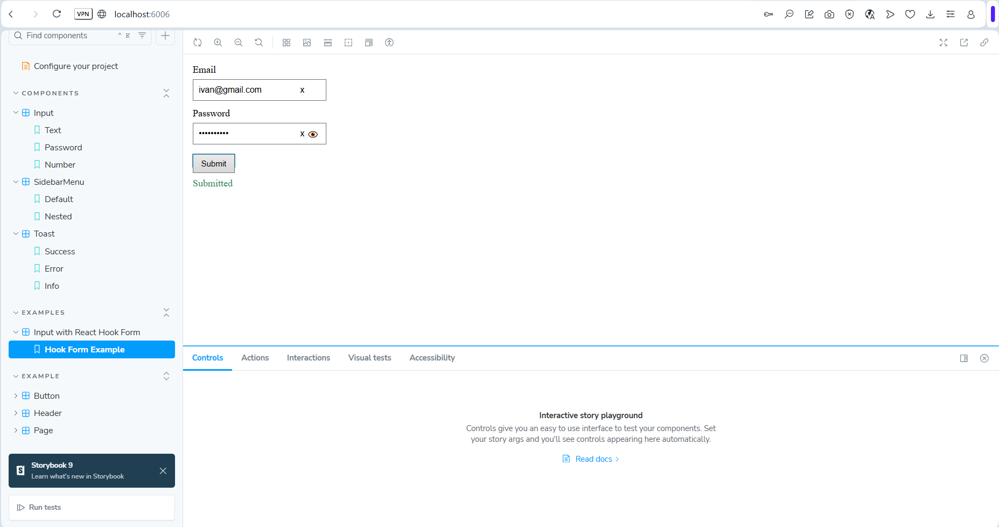

# Test-task

## How to Run the Project

1. Clone the repository:

   git clone https://github.com/IvanVoshchepynets/test-task-devtoday.git

2. Navigate into the folder:

   cd test-task

3. Install dependencies and start the storybook:

   npm install

   npm run storybook

## Components Overview

### Input

- **Types:** `text`, `password`, `number`
- **Props:** `clearable`, `placeholder`, `disabled`
- **Buttons:** x _Clear_ and 👁 _Show/Hide_
- **Integration:** compatible with `React Hook Form`

---

### Toast

- **Types:** `success`, `error`, `info`
- **Position:** bottom-right corner
- **Behavior:** automatically disappears after the given `duration`
- **Animation:** smooth fade/slide transition
- **Extras:** manual close button (x)

---

### SidebarMenu

- **Animation:** slides in from the right
- **Structure:** supports nested submenus (_accordion style_)
- **UX:** closes when clicking outside the menu
- **Visuals:** highlights the active item

## Components Screenshots

### Storybook UI

### Input Component

### Toast Component

### Sidebar Menu

### Input + Hook Form

